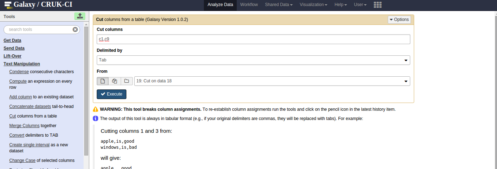
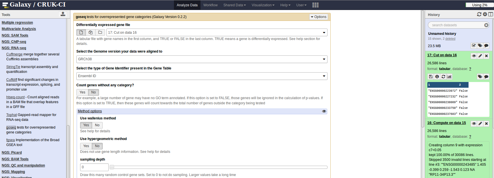

```{r setup, include=FALSE,echo=FALSE}
knitr::opts_chunk$set(echo = FALSE)
```

# How to manipulate a gene list

The golden rule before we start ***Always keep a backup of the output from the pipeline, never work on the original data***!

There are various tasks you might wish to perform on a gene list

- Search for our favourite gene
- Sort / Rank according to statistic or p-value
- Filter to obtain genes with particular cut-off and fold-change
- Re-order / re-arrange columns

Our recommended tools to perform such operations would be a programming language such as R / Python so that the operations can be scripted and automated. As a compromise, our Galaxy server provides various operations through an intuitive interface and allows the user to build a workflow to a chain of simple operations.

There is a special reason why you shouldn't trust Excel as your many means of interrogating the results. Sometimes it can be unhelpful and convert gene identifers into dates. [No, really!](https://genomebiology.biomedcentral.com/articles/10.1186/s13059-016-1044-7)

Please also bear in mind that over-processing of a results file in Excel may diminish how useful it is to Bioinformatic analysis in the future. Here are some materials you might like to check out

- [Avoiding Data Disasters](http://bioinformatics-core-shared-training.github.io//avoid-data-disaster/)
- [Data Carpentry lessons on Spreadsheets](http://www.datacarpentry.org/spreadsheet-ecology-lesson/01-format-data/)
- [Data Organisation tutorial by Karl Broman](http://kbroman.org/dataorg/)

We will only scratch the surface of what is possible with Galaxy. If you are new to the software, you can check out our course:- [http://galaxycam.github.io/](http://galaxycam.github.io/)

Different online tools or GUIs will take different types of input, but will probably involve some combination of the operations mentioned above. Therefore, we will introduce some tools in Galaxy that should allow you to manipulate your data into the required form. Later, we will give examples of workflows for particular gene set enrichment / pathways analysis tools.

In the first generic example, we will show some common manipulations on a gene list using Galaxy:-

## Common tasks in Galaxy

### Upload the gene list in csv form

The gene list `.csv` file can be uploaded into Galaxy. In this example we want to choose the file with no p-value cut-offs applied

***Get Data*** -> ***Upload File***


### Convert to tabular

Before we can go further, Galaxy needs to convert the data you just uploaded into *tabular* form by replacing commas with a tab. This can be done using the ***Text Manipulation*** -> ***Convert delimiters to TAB*** option. Make sure that *Commas* is selected from the drop-down.


### Filter

We can apply filtering using the menu option ***Filter and Sort*** -> ***Filter data on any column using simple expressions***. Here we use the condition `c7 <0.01 and c3 > 1.5` to require that Column 7 (adjusted p-value) is less than 0.05 *and* Column 3 (log fold-change) is greater than 1.5.


- filter on genes on a particular chromosome 
- within a certain range of start and end positions
- filter by gene name

## Selecting columns

If you find the number of columns in the file a bit unwieldy, you can also use the ***Text Manipulation*** -> ***Cut columns from a table*** to remove some columns, or re-order the existing ones:-


## Sorting by a column

We can also sort the table by values in a particular column. e.g. the log$_2$ fold change which is found in column number 3.


- can also sort by multiple columns
    + e.g. Chromosome, and then start

## Selecting the top "N" genes

We might want to consider the top 100, 200, genes in our list ranked according to p-value. This we can do with ***Text Manipulation*** -> ***Select first lines from a dataset***


 
## Creating a Galaxy workflow

The appeal of Galaxy is that these operations can be performed in succession, with each new operation using the output from the previous step. As you get more-advanced, your workflow can be saved, shared and re-used on other datasets. See Anne for more details or attend our [Galaxy course](http://galaxycam.github.io/)

e.g. Import -> Convert -> Filter by fold-change -> Top 100
 
***Shared Data*** ->  ***Workflows***


## R workflow

For those keen on R, equivalent operations can be performed with the `dplyr` package. See our [intermediate R](http://bioinformatics-core-shared-training.github.io/r-intermediate/) course for details. 

```{r message=FALSE}
library(dplyr)
deTable <- read.csv("t47d_Treatment_DEA_Prog-vs-Control_all.csv")
filteredTable <- filter(deTable, padj < 0.05, log2FoldChange > 1.5)
sortedTable <- arrange(filteredTable, log2FoldChange)
reducedTable <- select(filteredTable, X,baseMean,log2FoldChange)
```

# Gene-Ontologies and Pathways


In the early days of microarray analysis, people were happy if they got a handful of differentially-expressed genes that they could validate or follow-up. However, with later technologies (and depending on the experimental setup) we might have thousands of statistically-significant results, which no-one has the time to follow-up. Also, we might be interested in pathways / mechanisms that are altered and not just individual genes.

In this section we move towards discovering if our results are ***biologically significant***. Are the genes that we have picked statistical flukes, or are there some commonalities?

There are two different approaches one might use, and we will highlight the theory behind both

##  Over-representation analysis

- "Threshold-based" methods require defintion of a statistical threshold to define list of genes to test (e.g. FDR < 0.01)

```{r message=FALSE,echo=FALSE}
suppressPackageStartupMessages(library(org.Hs.eg.db))
result <- select(org.Hs.eg.db, keys="GO:0030291",keytype = "GO",columns="SYMBOL")
mygenes <- result$SYMBOL
```

Let's take the set of genes `r paste(mygenes, collapse=", ")`. With the exception of one, they all look to have significant p-value. But is this evidence enough that the whole pathway has been disturbed?

```{r echo=FALSE}
dplyr:::filter(deTable, symbol %in% mygenes)
```

The question we are asking here is;

> ***"Are the number of differentially expressed (DE) genes associated with Theme X significantly greater than what we might expect by chance alone?"***

We can answer this question by knowing

- the total number of DE genes
- the number of genes in your gene set
- the number of genes in your gene set that are found to be DE
- the total number of tested genes

The formula for Fishers exact test is;

$$ p = \frac{\binom{a + b}{a}\binom{c +d}{c}}{\binom{n}{a +c}} = \frac{(a+b)!(c+d)!(a+c)!(b+d)!}{a!b!c!d!n!} $$

with :-

|  | In DE List | Not In DE List  | Total
------------- | ------------- |  ------------- | ------------- | 
In Gene Set | a | b | a  +  b |
Not in Gene Set  | c | d | c + d |
Total | a + c | b +d | a + b + c + d (=n) |

In this first test, our genes will be grouped together according to their Gene Ontology (*GO*) terms:- [http://www.geneontology.org/](http://www.geneontology.org/)

## Software for conducting a over-representation test (goseq)

We will be using [`goseq`](https://www.bioconductor.org/packages/release/bioc/html/goseq.html), which is a software package available through [Bioconductor](www.bioconductor.org/). However, rather having to write R code, we will be using the package through our institute's Galaxy server.

This package has been *specifically-developed* for use with RNA-seq data. Plenty of methods have been applied to microarray data, but the assumptions might not hold for RNA-seq. For instance, `goseq` will [adjust for the length of a gene](http://genomebiology.biomedcentral.com/articles/10.1186/gb-2010-11-2-r14) as long and highly-expressed transcripts are known to be over-represented in lists of DE genes.

## Preparing the data for an over-representation test

We need to start with the list that contains results for *all* genes; Let's take `t47d_Treatment_DEA_Prog-vs-Control_all.csv`, which you can [download from here](https://bioinformatics-core-shared-training.github.io/rnaseq-pipeline/t47d_Treatment_DEA_Prog-vs-Control_all.csv)


The goal is to obtain a table with two columns; the first containing the gene identifier, and the second being `TRUE` or `FALSE` indicating whether the gene is differentially-expressed at a given cut-off (e.g. `0.05`). We don't have to be too rigourous when deciding the p-value cut-off, as we're using it as a means to filter the data and not the end-point of our analysis.

If you wish to see the R code (using `dplyr`) for manipulating our data to provide an input file for the gene set analysis, click the 'Code' / 'Hide' button on the right.

```{r message=FALSE}
library(dplyr)
deTable <- read.csv("t47d_Treatment_DEA_Prog-vs-Control_all.csv")
mutate(deTable, DE = padj < 0.05) %>% 
  mutate(DE = ifelse(is.na(DE),FALSE,DE)) %>% 
  dplyr:::select(X, DE) -> filteredTable
  write.table(filteredTable,"de-table-for-goseq.txt",quote=FALSE,row.names=FALSE)
filteredTable
```

Manipulating the file can also be done in Galaxy.

## Galaxy Workflow

### Import the csv file

***Get Data*** -> ***Upload Data***


### Convert to tabular form

***Text Manipulation*** -> ***Convert delimiters to TAB***

Select *Commas* from drop-down menu


### Remove header line

***Text Manipulation*** -> ***Select last lines from a dataset***

Make note of how many lines in file, *N* and remove *N-1* last lines with this tool


### Retain columns of interest

Put *c1,c2,c3,c4,c5,c6,c7,c12* to retain columns 1,2,3,4,5,6,7 and 12

***Text Manipulation*** -> ***Cut columns from a table***


### The cleaned dataset

The output from the previous step will be referred to as our *cleaned dataset* and we will use it later on for another type of downstream analysis.


We now need to determine if each gene is DE at 0.05 significance level

### Adding an extra column

***Text Manipulation*** -> ***Compute an expression on every row***

Use the expression `c7<0.05` to test if the adjusted p-value is less than 0.05


Which should give something like this


### Extracting the columns needed for goseq

***Text Manipulation*** -> ***Cut columns from a table***
Choose `c1,c9` as the columns to cut; the ensembl ID and the column created in the previous step



Which should give the following


### Running goseq

***NGS:RNA-seq*** -> ***goseq***

Select Genome version *hg19* in this case. You could also specify which type of identifiers can be found in the first column. *Ensembl* ID is the default and correct for our dataset.



After a while, you should notification that your analyis has completed and you can download the results by clicking the floppy disk icon.


### Things to try:

- Filter the output from the goseq analysis to gene sets with p-value less than 0.05

The differentially-expressed genes that we identified could either by up- or down-regulated. Sometimes we might want to look for over-represented genes in the up- or down-regulated genes only

- Let's suppose we want to analyse the up-regulated genes only
- Consider what changes you would need to make to the workflow and perform the analysis

## Threshold-free analysis

For these tests, we don't have to specify a statistical threshold and use the test statistics from *all* genes as the input to the test. The popular *Gene Set Enrichment Analysis (GSEA)* method uses this approach. These tests can be used to detect differential expression for a group of genes, even when the effects are too small or there is too little data to detect the genes individually.

Let's say that we have 10 genes "of interest". We can look-up their results from the table. For a threshold-free analysis we deal with test statistics or fold-change values that have directionality, as we typically want to identify gene sets that change expression in the same direction (i.e. all up- or down-regulated).
```{r echo=FALSE,message=FALSE}
library(limma)
deTable <- read.csv("t47d_Treatment_DEA_Prog-vs-Control_all.csv")
stats <- deTable$stat
statsOrder <- order(stats,decreasing = TRUE)
myIndex <-  c(sample(statsOrder[1:500],5),sample(501:length(stats),5))
data.frame(Gene = deTable$symbol[myIndex], Statistic = stats[myIndex])
```

Some of the statistics look high, but how do they compare to the rest of the genes? Are they towards the top of the list, or scattered randomly? This is what GSEA tries to determine. We are not making any claims about any particular gene in the list being DE, only that the set as a whole is altered.

We typically visualise the results of the analysis as a barcode plot. Firstly, all the test statistics are ranked from highest to lowest. We then draw a vertical line at every point where a gene in our list of interest is observed. We then determine where the *peak* of the distribution is, and consequently whether the genes are towards to top or bottom of the ranked list.

Here is the plot for our set:-

```{r echo=FALSE}
barcodeplot(stats, myIndex)
```

Indeed, it looks as though the statistics are concentrated at the top of our gene list.

The case where we have a down-regulated pathway might look something like:-

```{r echo=FALSE}
statsRevOrder <- order(stats,decreasing = FALSE)
myRevIndex <-  c(sample(statsRevOrder[1:500],5),sample(501:length(stats),5))
barcodeplot(stats, myRevIndex)
```

Or in the case of no enrichment, there is no particular pattern to where the genes occur in the ranked list

```{r echo=FALSE}
barcodeplot(stats, sample(1:length(stats),100))
```


The Broad institute provides [a version of GSEA](http://software.broadinstitute.org/gsea/index.jsp) that can be run via a java application. The input to GSEA is matrix of expression values and a file describing which covariate each sample belongs to. However, whether or not the method can be applied directly to RNA-seq data is under debate. According to the [GSEA faq](http://software.broadinstitute.org/cancer/software/gsea/wiki/index.php/FAQ#Can_I_use_GSEA_to_analyze_SNP.2C_SAGE.2C_ChIP-Seq_or_RNA-Seq_data.3F)

> The GSEA team has yet to determine whether any of these ranking statistics, originally selected for their effectiveness when used with expression data derived from DNA Microarray experiments, are appropriate for use with expression data derived from RNA-seq experiments. We hopefully will be able to devote some time to investigating this, but in the mean time, we are recommending use of the GSEAPreranked tool for conducting gene set enrichment analysis of data derived from RNA-seq experiments.

The GSEAPreranked tool mentioned is available through the Broad insitute's [GenePattern](https://genepattern.broadinstitute.org) analysis suite. However, we don't want to introduce yet another analysis suite, so we will focus on how to perform this analysis in Galaxy.

GSEA uses a set of pre-defined gene sets in their analysis which come under the following categories:-

- H hallmark gene sets
- C1 positional gene sets
- C2 curated gene sets
- C3 motif gene sets
- C4 computational gene sets
- C5 GO gene sets
- C6 oncogenic signatures
- C7 immunologic signatures

You can find out more about these gene sets on the [msigdb](http://software.broadinstitute.org/gsea/msigdb) website. However, it is important to note that these gene sets have **Human gene symbols** only.

e.g. C6 oncogenic signatures, which were used in the original GSEA analysis of this dataset

> Gene sets represent signatures of cellular pathways which are often dis-regulated in cancer. The majority of signatures were generated directly from microarray data from NCBI GEO or from internal unpublished profiling experiments which involved perturbation of known cancer genes. In addition, a small number of oncogenic signatures were curated from scientific publications.

## Preparing the gene set for a GSEA analysis

In order to perform the GSEAPreRanked analysis, one needs to create file with two columns; the first containing the gene symbol, and the second is the (ranked) statistic for the gene. For those interested, here is the R code to produce a file suitable for GSEA analysis:-

```{r}
library(dplyr)
deTable <- read.csv("t47d_Treatment_DEA_Prog-vs-Control_all.csv")
deTable %>% arrange(desc(stat)) %>% 
  dplyr:::select(symbol, stat) %>% 
  filter(!is.na(symbol)) -> orderedTable
orderedTable
```

Now lets walkthrough how to do that in Galaxy:-

### Ranking the genes

Make sure your ***cleaned dataset*** is selected (converted to tabular, removed header and cut columns), sort on column 5 (the test statistic)

***Filter and Sort*** -> ***Sort data in ascending or descending order***


Giving the output:-


We now have all the information we need, but the GSEA tool expects only two columns; gene symbol and ranked statistic

### Cutting the columns

Extract columns 8 (gene symbol) followed by test statistic; `c8,c5`

***Text Manipulation*** -> ***Cut columns from a table***


## Running a GSEA analysis

### Using the fGSEA tool

`fGSEA` is a Bioconductor package that implements the pre-ranked GSEA analysis. It also happens to be a faster implementation, as described in their [pre-print](http://biorxiv.org/content/early/2016/06/20/060012)

You can find the tool under ***NGS: RNA-seq Analysis***


With this tool, three different outputs are produced

- a results table
- a summary graphic of the top pathways
- enrichment plots for the top pathways

## Things to try:

- Can you identify pathways that are significant at 0.05 level?
- What pathways are over- and under-represented?


# MetaCore

> "Your GPS in Systems Biology"

The institute has a license for [Metacore](https://portal.genego.com/) by Thomson Reuters. You must first obtain a login (email *Ashley Sawle* in the Bioinformatics Core), and then book time to use the site (our license only permits one user to be logged-in at a time). Not only does Metacore provide a smart interface, but they have invested a lot of time manually-curating results from the literature. Consequently, their database and gene networks are proprietary and what the license fee is paying for.

- (for CRUK use only) [Training Materials](https://sharepoint.cri.camres.org/sites/bioinformatics/Public/Metacore/CRUK%20Cambridge%20Training%2006032015.pdf)


## Preparing for Metacore in Galaxy

***Text Manipulation*** -> ***Cut columns for a table*** 

Select Ensembl IDs, log2FoldChange and adjusted p-value (columns 1, 3 and 7).


Or, in R:-

```{r}
read.csv("t47d_Treatment_DEA_Prog-vs-Control_all.csv") %>% #head
  dplyr:::select(X,log2FoldChange, padj) %>% 
    write.table("t47d_Treatment_DEA_Prog-vs-Control_all_forMetacore.txt",sep="\t",quote=FALSE,row.names=FALSE)
```


You are then ready to load the data into Metacore:-


***Upload*** -> ***Upload Experiments with Gene or Protein IDs***


Specify types of data in each column


