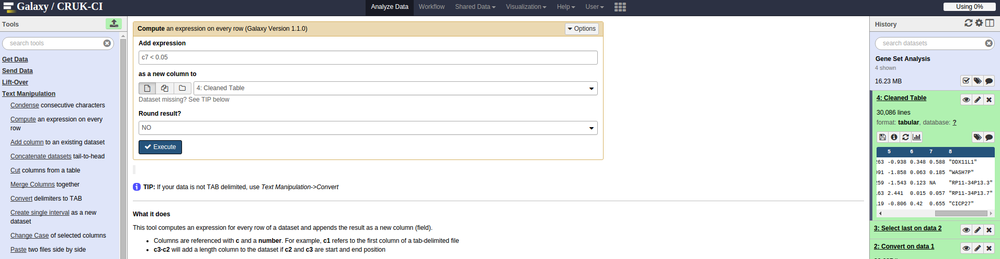
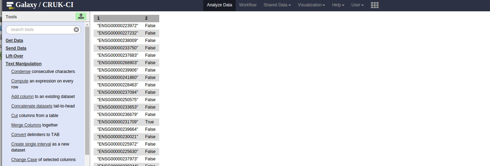
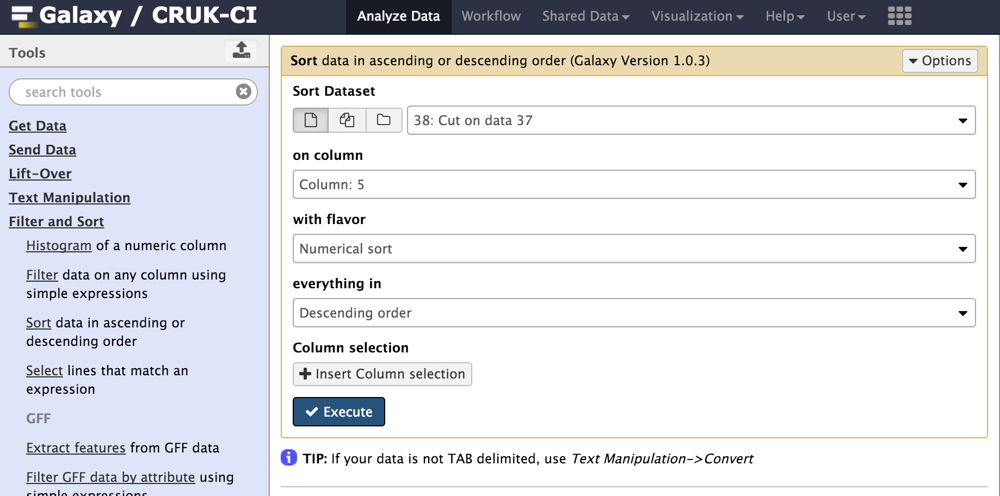
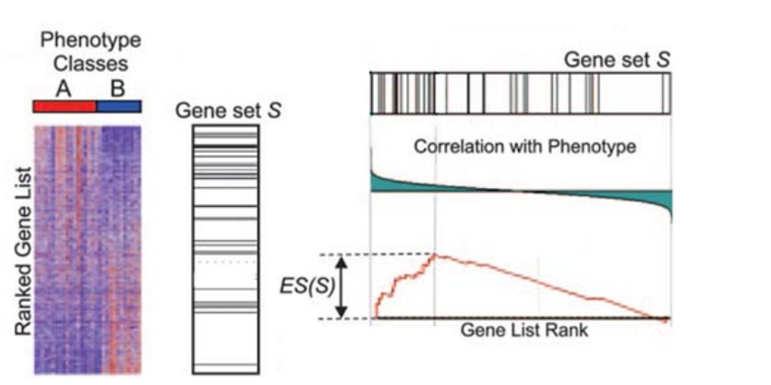

```{r setup, include=FALSE,echo=FALSE}
knitr::opts_chunk$set(echo = FALSE)
```

# How to manipulate a gene list

The golden rule before we start ***Always keep a backup of the output from the pipeline, never work on the original data***!

There are various tasks you might wish to perform on a gene list

- Search for our favourite gene
- Sort / Rank according to statistic or p-value
- Filter to obtain genes with particular cut-off and fold-change
- Re-order / re-arrange columns

Our recommended tools to perform such operations would be a programming language such as R / Python so that the operations can be scripted and automated. As a compromise, our Galaxy server provides various operations through an intuitive interface and allows the user to build a workflow to a chain of simple operations.

Different online tools or GUIs will take different types of input, but will probably involve some combination of the operations mentioned above. Therefore, we will introduce some tools in Galaxy that should allow you to manipulate your data into the required form. Later, we will give examples of workflows for particular gene set enrichment / pathways analysis tools.

In the first generic example, we will show how to filter a gene list using Galaxy:-

## How to apply an alternative filter to the gene list in Galaxy

### Upload the gene list in csv form

The gene list `.csv` file can be uploaded into Galaxy. In this example we want to choose the file with no p-value cut-offs applied


### Convert to tabular

Before we can go further, Galaxy needs to convert the data you just uploaded into *tabular* form by replacing commas with a tab. This can be done using the ***Text Manipulation*** -> ***Convert delimiters to TAB*** option. Make sure that *Commas* is selected from the drop-down.


### Filter

We can apply filtering using the menu option ***Filter and Sort*** -> ***Filter data on any column using simple expressions***. Here we use the condition `c7 <0.01 and c3 > 1.5` to require that Column 7 (adjusted p-value) is less than 0.05 *and* Column 3 (log fold-change) is greater than 1.5.


You could also use this menu to filter to genes on a particular chromosome or within a certain range of start and end positions

## (Optional) select columns


## (Optional) sorting by a column

We can also sort the table by values in a particular column. e.g. the log$_2$ fold change.


## R workflow

For those keen on R, equivalent operations can be performed with the `dplyr` package. See our [intermediate R](http://bioinformatics-core-shared-training.github.io/r-intermediate/) course for details. 

```{r message=FALSE}
library(dplyr)
deTable <- read.csv("t47d_Treatment_DEA_Prog-vs-Control_all.csv")
filteredTable <- filter(deTable, padj < 0.05, log2FoldChange > 1.5)
sortedTable <- arrange(filteredTable, log2FoldChange)
reducedTable <- select(filteredTable, X,baseMean,log2FoldChange)
```

# Gene-Ontologies and Pathways

## Gene-Ontology Analysis

In the early days of microarray analysis, people were happy if they got a handful of differentially-expressed genes that they could validate or follow-up. However, with later technologies (and depending on the experimental setup) we might have thousands of statistically-significant results, which no-one has the time to follow-up. Also, we might be interested in pathways / mechanisms that are altered and not just individual genes.

In this section we move towards discovering if our results are ***biologically significant***. Are the genes that we have picked statistical flukes, or are there some commonalities. 

There are two different approaches one might use, and we will cover the theory behind both


## Theory Part I: Over-representation analysis

- "Threshold-based": require defintion of a statistical threshold to define list of genes to test (e.g. FDR < 0.01)
- Hypergeometric test or Fisher's Exact test generally used.

The question we are asking here is;

> ***"Are the number of DE genes associated with Theme X significantly greater than what we might expect by chance alone?"***

Where Theme X could be genes belonging to a particular GO (Gene Onotology) term or pathway.

Let's imagine that we have a bag full of balls. Each balls represents a gene in the *gene universe*. 
- Paint the balls representing our selected list grey, and paint the rest red.


In this small example, we can know in advance the total number of balls and total number in our category of interest

- Total number of balls: 40
- Total number of interesting (grey) balls: 10

Now, lets select a number (say, 12) of the balls at random without seeing into the bag and look at what we get


We can express a particular choice of balls as a table:-

|  | In Selection | Not In Selection | Total
------------- | ------------- |  ------------- | ------------- | 
Grey Selected | 8 | 2 | 10 |
Grey Not Selected  | 4 | 26 | 30 |
Total | 12 | 6 | 40 |


The formula for Fishers exact test is;

$$ p = \frac{\binom{a + b}{a}\binom{c +d}{c}}{\binom{n}{a +c}} = \frac{(a+b)!(c+d)!(a+c)!(b+d)!}{a!b!c!d!n!} $$
with :-

|  | In Selection | Not In Selection | Total
------------- | ------------- |  ------------- | ------------- | 
Grey Selected | a | b | a  +  b |
Grey Not Selected  | c | d | c + d |
Total | a + c | b +d | a + b + c + d (=n) |


or less formally;

*P = (ways of choosing grey balls) X (ways of non-grey balls amongst subset) / ways of choosing subset*


Fortunately, we have software to calculate these quantities!

## Software for conducting a over-representation test (goseq)

We will be using [`goseq`](https://www.bioconductor.org/packages/release/bioc/html/goseq.html), which is a software package available through [Bioconductor](www.bioconductor.org/). However, rather having to write R code, we will be using the package through our institute's Galaxy server.

This package has been *specifically-developed* for use with RNA-seq data. Plenty of methods have been applied to microarray data, but the assumptions might not hold for RNA-seq. For instance, `goseq` will adjust for the length of a gene.

## Preparing the data for an over-representation test

We can start with the list that contains results for *all* genes; Let's take `t47d_Treatment_DEA_Prog-vs-Control_all.csv`

```{r}
deTable <- read.csv("t47d_Treatment_DEA_Prog-vs-Control_all.csv")
deTable
```

The goal is to obtain a table with two columns; the first containing the gene identifier, and the second being `TRUE` or `FALSE` indicating whether the gene is differentially-expressed at a given cut-off (e.g. `0.05`). 

There are several ways of doing this. If you wish to see the R code (using `dplyr`), click the 'Code' button on the right.

```{r message=FALSE}
library(dplyr)
deTable <- read.csv("t47d_Treatment_DEA_Prog-vs-Control_all.csv")
mutate(deTable, DE = padj < 0.05) %>% 
  mutate(DE = ifelse(is.na(DE),FALSE,DE)) %>% 
  select(X, DE) -> filteredTable
  write.table(filteredTable,"de-table-for-goseq.txt",quote=FALSE,row.names=FALSE)
filteredTable
```

Manipulating the file can also be done in Galaxy.

## Importing the Gene list into Galaxy

### Import the csv file

***Get Data*** -> ***Upload Data***


### Convert to tabular form

***Text Manipulation*** -> ***Convert delimiters to TAB***

Select *Commas* from drop-down menu


### Remove header line

***Text Manipulation*** -> ***Select last lines from a dataset***

Make note of how many lines in file, *N* and remove *N-1* last lines with this tool


### Retain columns of interest

Put *c1,c2,c3,c4,c5,c6,c7,c12* to retain columns 1,2,3,4,5,6,7 and 12

***Text Manipulation*** -> ***Cut columns from a table***


### The cleaned dataset

The output from the previous step will be referred to as our *cleaned dataset*


## Performing a Gene Set Analysis in Galaxy

From our cleaned table in the previous steps, we need to compute if each gene is DE at 0.05 significance level

### Adding an extra column

***Text Manipulation*** -> ***Compute an expression on every row***

Use the expression `c7<0.05` to test if the adjusted p-value is less than 0.05



Which should give something like this


### Extracting the columns needed for goseq

***Text Manipulation*** -> ***Cut columns from a table***
Choose `c1,c9` as the columns to cut


Which should give the following



### Running goseq

***NGS:RNA-seq** -> goseq

Select Genome version *hg19* in this case. Could also specify which type of identifiers can be found in the first column. *Ensembl* ID is correct in this case.




## Theory Part II: Threshold-free

For these tests, we don't have to specify a statistical threshold and use the test statistics from *all* genes as the input to the test. The popular *Gene Set Enrichment Analysis (GSEA)* uses this approach. These tests can be used to detect differential expression for a group of genes, even when the effects are too small or there is too little data to detect the genes individually.



- Rank all your genes according to test statistic or fold-change
- For a particular gene set of interest, look down the gene list and compute a score
    + Go up one unit on the y-axis if the gene you encounter is contained in your gene list
    + Go down one unit if the gene is not contained in the gene list
    + Plot the score against position in gene list
    + If there is a peak at the left or right, then your set is enriched.


The Broad institute provides [a version of GSEA](http://software.broadinstitute.org/gsea/index.jsp) that can be run via a java application. 
The required input text contains a set of gene identifiers that are ordered according to some test statistic.

```{r}
library(dplyr)
deTable <- read.csv("deseq2_results/t47d_Treatment_DEA_Prog-vs-Control_all.csv")
deTable %>% arrange(desc(stat)) %>% 
  dplyr:::select(symbol, stat) %>% 
  filter(!is.na(symbol)) -> orderedTable
orderedTable
```


## Preparing the gene set for a GSEA analysis

### Ranking the genes

From the *cleaned* table created above, sort on column 5 (the test statistic)

***Filter and Sort*** -> ***Sort data in ascending or descending order***


Giving the output:-


### Cutting the columns

Extract columns 8 (gene symbol) followed by test statistic; `c8,c5`

***Text Manipulation*** -> ***Cut columns from a table***


### Remove rows without a gene symbol


## Using the GSEAPreranked